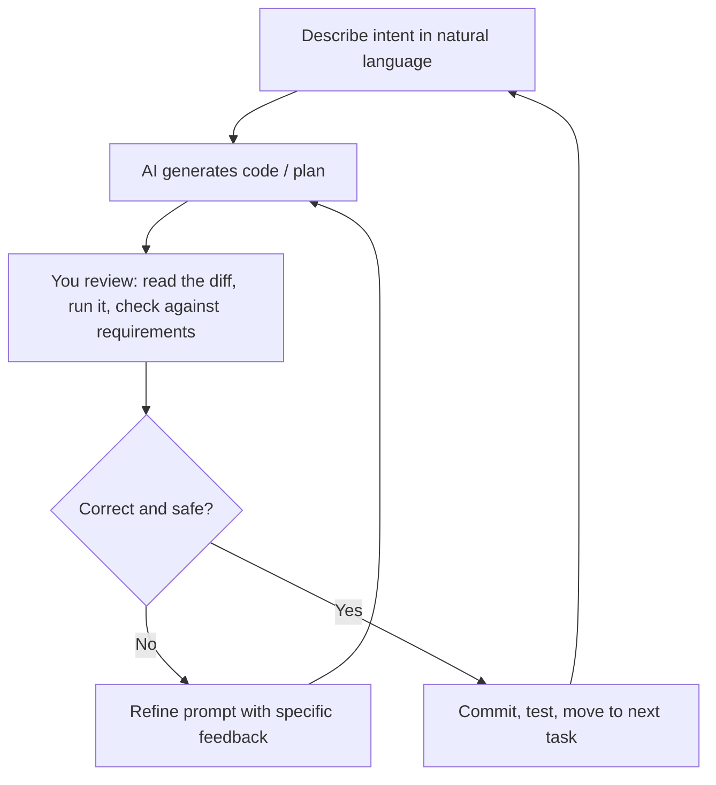
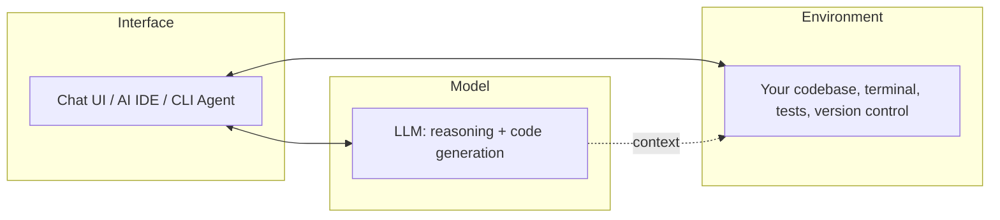

# Introduction to Vibe Coding

## Introduction

Vibe coding is the practice of building software through iterative,
natural-language collaboration with an AI model, instead of writing
every line by hand. You describe intent — a feature, a fix, a
refactor — the model produces code, you review and run it, and you
iterate until it's correct. The term was popularized in 2025 to describe
a workflow that had already been forming around capable coding models,
AI-native IDEs, and CLI agents.

This page sets the frame for the rest of the repository: what vibe
coding is, what it isn't, and why the practices in later chapters
(planning, testing, security review) are not optional extras — they are
what separates "vibe coded" from "vibe coded *well*."

## Why It Matters

AI models can now generate working code for a large fraction of routine
programming tasks — CRUD endpoints, UI components, test scaffolding,
boilerplate configuration — in seconds instead of minutes or hours. That
changes where a developer's time and judgment matter most: less on
typing syntax, more on specifying the right problem, evaluating
generated output, and making architectural decisions the model can't
make for you.

Teams and individuals who learn to do this well ship faster without a
corresponding increase in defects. Teams who skip the judgment side —
accepting whatever the model outputs without review — tend to ship
faster *and* accumulate more bugs, security issues, and unmaintainable
code. This repository is built to keep you on the first path.

## First Principles

1. **The model is a collaborator, not an oracle.** It can be
   confidently wrong. Treat its output as a strong first draft that
   needs your review, not a finished answer.
2. **Specification quality determines output quality.** A vague prompt
   produces vague, often incorrect code. A precise prompt with context,
   constraints, and examples produces code close to what you actually
   need. See [Prompt Engineering](../07-prompt-engineering/README.md).
3. **Planning still happens — it just happens in natural language
   first.** Skipping design because "the AI will figure it out" is the
   single most common cause of vibe-coded projects that collapse under
   their own complexity. See [Planning](../08-planning/README.md).
4. **You are still responsible for the code.** Legally, professionally,
   and practically, code you ship is your code, regardless of who or
   what typed it. Review it as such.
5. **Fast iteration is the core advantage — protect it.** The value of
   vibe coding comes from tight feedback loops. Anything that breaks
   that loop (huge unreviewed diffs, unclear requirements, no tests to
   validate against) erodes the entire benefit.

## How It Works

A typical vibe coding loop looks like this:



The loop is deliberately short. Long, unreviewed stretches where you
accept many AI-generated changes without running or reading them are
where quality breaks down — the same way large, unreviewed human PRs
are riskier than small, frequent ones.

## Architecture of a Vibe Coding Workflow

At the tooling level, a modern vibe coding setup usually has three
layers:



- **Interface** — how you talk to the model: a chat window, an
  AI-integrated IDE (Cursor, Windsurf, etc.), or a CLI agent (Claude
  Code and similar) that can read and edit files directly.
- **Model** — the LLM doing the reasoning and code generation. Covered
  in [AI Models](../03-ai-models/README.md).
- **Environment** — your actual project: files, terminal, test suite,
  version control. The model's usefulness is bounded by how much of this
  it can see and act on.

## Real Examples

**Good vibe coding loop:** "Add a `/health` endpoint to this Express
app that returns `{status: "ok", uptime}`. Follow the existing route
pattern in `routes/users.js`." — specific, scoped, references existing
conventions. The AI has enough context to produce something close to
correct on the first pass, and the change is small enough to review in
under a minute.

**Poor vibe coding loop:** "Build me a SaaS app for managing gym
memberships." — no constraints, no architecture decisions, no tech
stack, no scope boundary. The AI will make dozens of unstated decisions
for you, many of which you'll disagree with once you see them, and the
resulting code will be too large to meaningfully review in one pass.
The fix is not to avoid AI for big projects — it's to break the request
down first. See [Planning](../08-planning/README.md) and the
[SaaS Blueprint](../../guides/blueprints/saas/README.md).

## Best Practices

- Work in small, reviewable increments — one feature or fix per loop.
- Always run the code the model produces before trusting it.
- Keep your own mental model of the architecture; don't let the AI's
  decisions silently drift the design away from what you intended.
- Use version control aggressively — commit working states often so you
  can always roll back a bad AI-generated change.
- Read diffs, not just outcomes. "It works" is not the same as "it's
  correct and safe."

## Common Mistakes

| Mistake | Why it hurts | Fix |
|---|---|---|
| Accepting large, unreviewed diffs | Bugs and security issues hide in volume | Ask for smaller, incremental changes |
| No test suite to validate against | You can't tell "looks right" from "is right" | Write or generate tests alongside features, see [Testing](../15-testing/README.md) |
| Treating first output as final | Models often need 2-3 iterations to converge | Budget for iteration, don't stop at "it compiles" |
| Skipping architecture decisions | AI fills gaps with defaults you didn't choose | Plan structure before generating code |
| No security review | AI can reproduce insecure patterns confidently | See [Security](../18-security/README.md) |

## Prompt Templates

```text
You are helping me implement [specific feature] in [language/framework].

Context:
- Existing pattern to follow: [file/pattern reference]
- Constraints: [performance, style, dependencies allowed/disallowed]
- Out of scope: [explicitly excluded behavior]

Task:
[One clear, scoped request]

Before writing code, briefly confirm your understanding of the task in
2-3 bullet points, then implement it.
```

## Summary

Vibe coding is real, professional, and increasingly standard practice —
but it is a skill with its own discipline, not a way to skip
engineering fundamentals. The rest of this repository builds that
discipline: how to choose models and tools, how to prompt effectively,
how to plan and design systems, and how to build, test, secure, and ship
real software with AI as a collaborator.

## Related Pages

- [AI Coding Fundamentals](../02-fundamentals/README.md)
- [AI Models](../03-ai-models/README.md)
- [Prompt Engineering](../07-prompt-engineering/README.md)
- [Planning](../08-planning/README.md)
- [Common Mistakes](../25-common-mistakes/README.md)
