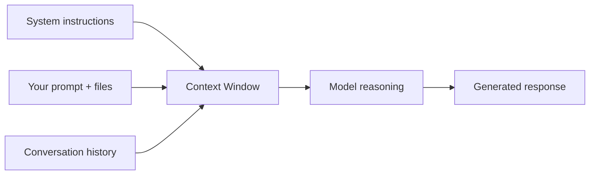

# AI Coding Fundamentals

## Introduction

Before working effectively with AI coding tools, you need a shared
vocabulary and mental model for what these systems actually do. This
page covers the core concepts — context windows, tokens, hallucination,
grounding, and the difference between autocomplete-style assistance and
agentic coding — that every later chapter assumes you know.

## Why It Matters

Misunderstanding what an AI model can and can't do is the root cause of
most bad experiences with these tools. People blame "the AI is bad at
coding" for failures that are actually context-window limits, missing
project context, or an ambiguous prompt. Understanding the fundamentals
lets you diagnose *why* something went wrong and fix the actual cause.

## First Principles

1. **Models predict text, not truth.** An LLM generates the most
   statistically plausible continuation of your prompt given its
   training. It does not "know" your codebase unless that information is
   in its context window.
2. **Context is everything.** The model's entire understanding of your
   project, in any given response, is limited to what's in its context
   window — the prompt, any attached files, and prior conversation. It
   has no persistent memory of your codebase beyond that.
3. **Hallucination is a structural property, not a bug you can fully
   eliminate.** Models can generate plausible-looking but incorrect
   APIs, library methods, or facts. Verification is your job.
4. **More capable ≠ infallible.** Frontier models are dramatically
   better than early ones at multi-step reasoning and long-context code
   tasks, but the fundamental limitations (context bounds, occasional
   hallucination) still apply — just at a higher ceiling.

## How It Works

### Tokens and context windows

Models process text as **tokens** (roughly 3-4 characters of English
text per token). Every model has a **context window** — a maximum
number of tokens it can consider at once, covering your prompt, any
attached files, conversation history, and the response it generates.



If your codebase is larger than what fits in context, the model only
sees what you (or your tool) explicitly include. This is why AI IDEs
and CLI agents that can search and read files on demand are more
effective on large codebases than pasting code into a chat window.

### Autocomplete vs. chat vs. agentic coding

| Mode | What it does | Example tools |
|---|---|---|
| Autocomplete | Predicts the next few lines as you type | GitHub Copilot (inline mode) |
| Chat-assisted | You describe a task, the model writes code in a conversation, you copy it in | ChatGPT, Claude.ai |
| IDE-integrated | The model can read your open files and apply edits directly in the editor | Cursor, Windsurf, Claude in an IDE extension |
| Agentic / CLI | The model can read the file system, run commands, run tests, and iterate autonomously across multiple steps | Claude Code, CLI coding agents |

Each mode trades off autonomy against control. Autocomplete is low-risk
and low-leverage; agentic coding is high-leverage but requires more
trust and more review discipline. See
[AI IDEs](../04-ai-ides/README.md) and [CLI Agents](../06-cli-agents/README.md).

### Grounding

"Grounding" means giving the model real, verifiable information instead
of relying on what it might guess. Concretely: pointing it at actual
files, actual error messages, actual test output — instead of describing
them from memory. Grounded prompts produce far more reliable output than
prompts that ask the model to reason about code it can't see.

## Real Examples

**Ungrounded (weak):** "Why is my login function broken?" — the model
has no code to look at and will guess at generic causes.

**Grounded (strong):** Pasting the actual function, the actual error
stack trace, and the relevant config — the model can reason about the
real failure instead of a generic one.

## Best Practices

- Prefer tools that can read your actual files over copy-pasting
  fragments into a chat window, especially past a few hundred lines.
- Always include error messages and stack traces verbatim, not
  paraphrased.
- When a model references a library method or API you don't recognize,
  verify it exists before relying on it — this is the single most common
  hallucination pattern in coding tasks.
- Break large tasks into smaller ones that fit comfortably in context
  with room for reasoning, rather than maximizing what you stuff in.

## Common Mistakes

| Mistake | Why it hurts | Fix |
|---|---|---|
| Assuming the model remembers earlier sessions | Most tools don't persist memory by default | Re-supply relevant context each session, or use tools with explicit memory/project features |
| Trusting an unfamiliar API call without checking | Hallucinated methods compile-fail or behave unexpectedly | Check official docs before shipping |
| Pasting huge files "just in case" | Wastes context budget, dilutes relevant signal | Include only what's relevant to the task |
| Describing a bug instead of showing it | Model reasons about your description, not reality | Always paste actual error output |

## Prompt Templates

```text
Here is the relevant code (unmodified) and the exact error I'm seeing:

--- file: [path] ---
[paste code]

--- error ---
[paste full stack trace / error output]

Explain the root cause first, then propose a fix. Don't guess at parts
of the code you haven't seen — ask if you need another file.
```

## Summary

AI coding tools are prediction engines operating within a bounded
context window, not omniscient collaborators. Understanding tokens,
context limits, hallucination, and grounding lets you set up prompts and
workflows that play to the model's strengths and avoid its predictable
failure modes.

## Related Pages

- [Introduction to Vibe Coding](../01-introduction/README.md)
- [AI Models](../03-ai-models/README.md)
- [Prompt Engineering](../07-prompt-engineering/README.md)
- [CLI Agents](../06-cli-agents/README.md)
