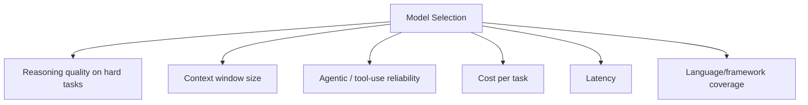

# AI Models for Coding

## Introduction

Not all AI models are equally suited to coding tasks, and model
capability changes fast. This page gives you a durable framework for
evaluating and choosing models, rather than a snapshot ranking that will
be stale in months.

## Why It Matters

Model choice affects cost, speed, output quality, and what workflows are
even possible (e.g., agentic multi-file editing requires strong
tool-use, not just good code completion). Picking a model that doesn't
match your task wastes money on tasks that didn't need a frontier model,
or produces poor results on tasks that did.

## First Principles

1. **Bigger context ≠ better reasoning.** A large context window lets a
   model see more code; it doesn't guarantee it reasons well over that
   code. Evaluate both separately.
2. **Coding ability and agentic ability are different skills.** A model
   can be excellent at writing a function in isolation and mediocre at
   multi-step autonomous tasks (planning, running commands, recovering
   from errors) — or vice versa.
3. **Cost scales with capability, usually non-linearly.** The most
   capable "frontier" models often cost far more per token than
   mid-tier models, for a quality gain that matters on hard tasks and is
   wasted on easy ones.
4. **Benchmarks are directional, not decisive.** Coding benchmarks
   (e.g., SWE-bench-style evaluations) are useful signals but don't
   capture your specific codebase, language, or task type. Trial on your
   actual work before committing.

## How It Works

### What to evaluate



| Dimension | Why it matters | How to check |
|---|---|---|
| Reasoning quality | Determines correctness on non-trivial logic | Test on a real, hard task from your codebase |
| Context window | Determines how much code it can consider at once | Vendor docs; verify effective usable length, not just advertised max |
| Agentic reliability | Determines whether it can be trusted to run multi-step tasks unsupervised | Test with a real multi-file refactor and observe recovery from errors |
| Cost per task | Determines sustainable usage at scale | Compare token pricing × typical task token usage |
| Latency | Affects whether it fits interactive vs. batch workflows | Time a few representative requests |
| Language coverage | Some models are stronger in some ecosystems | Test in your actual stack, not a generic benchmark language |

### Model tiers (framework, not a fixed list)

Providers commonly offer multiple tiers of the same model family, e.g. a
fast/cheap tier for routine tasks and a frontier tier for hard reasoning.
A practical pattern:

- **Fast/cheap tier** — autocomplete, boilerplate, simple refactors,
  high-volume tasks.
- **Mid tier** — most day-to-day feature work.
- **Frontier tier** — architecture decisions, hard debugging, security
  review, large multi-file agentic tasks.

Matching task difficulty to model tier is usually the single biggest
lever on both cost and quality — more so than picking "the best" model
for everything.

## Real Examples

- Generating a repetitive CRUD endpoint from an existing pattern: a
  fast/cheap tier model is usually sufficient and much cheaper.
- Diagnosing a subtle race condition across three services: worth using
  a frontier-tier model with strong reasoning, since the cost of a wrong
  diagnosis (hours of misdirected debugging) dwarfs the token cost
  difference.

## Best Practices

- Default to a cheaper/faster model for routine work; escalate to a
  stronger model when a task involves non-trivial reasoning, security,
  or architecture.
- Re-evaluate your model choice periodically — this space moves fast,
  and a model that was the best choice six months ago may no longer be.
- Test candidate models on a fixed, representative task from your own
  codebase before switching your default — public benchmarks won't tell
  you how a model handles your specific stack.
- Track cost per completed task, not just cost per token, when comparing
  models — a cheaper model that needs 3 retries can cost more overall.

## Common Mistakes

| Mistake | Why it hurts | Fix |
|---|---|---|
| Always using the most expensive/capable model | Wastes budget on tasks that didn't need it | Match tier to task difficulty |
| Choosing based on benchmark leaderboards alone | Benchmarks don't reflect your codebase/language | Run your own representative test |
| Ignoring agentic reliability separately from raw code quality | A model can write great code but manage multi-step tasks poorly | Test both dimensions independently |
| Never re-evaluating model choice | Model landscape changes every few months | Revisit quarterly |

## Prompt Templates

```text
I'm evaluating this model for [specific task type, e.g. "multi-file
refactors in a Django codebase"].

Task: [a real, representative task from your project]

After completing it, I'll be scoring: correctness, whether it asked for
missing context instead of guessing, and how many iterations it took to
converge.
```

## Summary

Choose models by matching task difficulty to model tier, evaluating
reasoning quality and agentic reliability separately from raw code
generation, and testing against your own real tasks rather than relying
solely on benchmarks or vendor marketing. Revisit your choice regularly.

## Related Pages

- [AI Coding Fundamentals](../02-fundamentals/README.md)
- [AI IDEs](../04-ai-ides/README.md)
- [CLI Agents](../06-cli-agents/README.md)
- [Prompt Engineering](../07-prompt-engineering/README.md)
