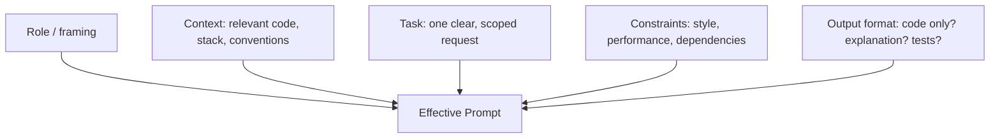

# Prompt Engineering for Developers

## Introduction

Prompt engineering, for coding, is the practice of structuring your
requests so an AI model produces correct, relevant code with minimal
back-and-forth. It's the single highest-leverage skill in this entire
repository — better prompts improve every other workflow.

## Why It Matters

The gap between a vague prompt and a well-structured one is often the
difference between code that works on the first try and three rounds of
frustrated correction. Since every loop costs time (and, with paid
models, money), prompt quality compounds across a whole project.

## First Principles

1. **Specificity beats brevity.** A longer prompt with concrete
   constraints outperforms a short, vague one almost every time for
   non-trivial tasks.
2. **Show, don't describe.** Real code, real errors, and real examples
   ground the model far better than descriptions of them.
3. **State constraints explicitly.** Models default to "reasonable"
   choices that may not match your stack, style, or requirements unless
   you say otherwise.
4. **Ask for a plan before code, on non-trivial tasks.** Having the
   model restate its understanding first catches misunderstandings
   before they become wasted code.
5. **Iterate with targeted feedback**, not "try again" — point at what's
   specifically wrong.

## How It Works

### Anatomy of an effective coding prompt



| Component | Purpose | Example |
|---|---|---|
| Role/framing | Sets expected expertise/behavior | "You are reviewing this for production readiness." |
| Context | Grounds the model in your real project | Paste the relevant file(s), mention framework/version |
| Task | The actual ask, scoped to one unit of work | "Add input validation to this endpoint" |
| Constraints | Prevents unwanted defaults | "No new dependencies. Match the existing error format." |
| Output format | Controls what you get back | "Return only the modified function, no explanation." |

### Positive and negative examples

**Weak prompt:**
> "Make this faster."

Vague — faster how, by how much, at what cost (readability, memory,
dependencies)? The model will guess.

**Strong prompt:**
> "This function processes a 100k-row CSV and currently takes ~40s
> (profiled with `cProfile`, bottleneck is the nested loop at line 22).
> Optimize for speed without changing the function signature or adding
> new dependencies. Explain the complexity before/after."

Specific about the problem, the constraint, and what "done" looks like.

### Chain-of-thought / step-by-step requests

For non-trivial logic, explicitly asking the model to reason step by
step before producing code reduces logic errors:

```text
Before writing code, walk through the algorithm step by step in plain
language, including edge cases you'll need to handle. Then implement it.
```

### Requesting structured output

When you need output you can parse or act on programmatically, specify
the exact structure (e.g., a fenced code block, specific XML tags, or
JSON), and give an example of the format:

```text
Respond only with a JSON array of objects shaped like:
{"file": "path", "change": "one-line summary"}
No prose outside the JSON.
```

## Real Examples

**Debugging prompt:**
```text
Here's the function and the exact stack trace:

[code]
[traceback]

Diagnose the root cause first (don't fix yet). I want to understand
before applying a change.
```

**Refactor prompt:**
```text
Refactor this component to use hooks instead of class lifecycle
methods. Keep all existing prop names and external behavior identical.
Do not change styling. Show the diff, not the full file.
```

## Best Practices

- Scope one prompt to one unit of work — a single feature, fix, or
  refactor, not "build the whole app."
- Always include real code and real errors instead of paraphrasing.
- State what should *not* change, not just what should.
- For anything you'll rely on, ask the model to flag uncertainty rather
  than presenting a guess as fact.
- Save prompts that worked well for a recurring task — that's what the
  [Prompt Library](../../prompts/) is for.

## Common Mistakes

| Mistake | Why it hurts | Fix |
|---|---|---|
| One giant prompt for a whole feature/app | Impossible to review, high error accumulation | Break into scoped, sequential prompts |
| No constraints stated | Model fills gaps with its own defaults | State stack, style, and boundaries explicitly |
| "Fix it" with no error detail | Model guesses at the problem | Always paste exact errors/output |
| Accepting the first draft without asking "why" | Misses reasoning errors | For non-trivial logic, ask for reasoning before code |

## Prompt Templates

```text
## Role
You are helping implement a feature in a production [language/framework] codebase.

## Context
- Relevant files: [paste or reference]
- Conventions to follow: [naming, error handling, test patterns]
- Stack/versions: [e.g. Node 20, Express 4, Postgres 15]

## Task
[One clear, scoped request]

## Constraints
- Do not modify: [files/behavior to leave untouched]
- Do not add: [dependencies, patterns to avoid]

## Output
Return the diff only. Briefly note any assumptions you made.
```

## Summary

Effective prompting is structured, grounded, and scoped: give the model
real context, one clear task, explicit constraints, and a defined output
format. This single skill improves the reliability of every other
workflow in this repository.

## Related Pages

- [AI Coding Fundamentals](../02-fundamentals/README.md)
- [Planning](../08-planning/README.md)
- [Prompt Library](../../prompts/)
- [Cheat Sheet: Prompt Engineering](../../cheat-sheets/prompt-engineering.md)
