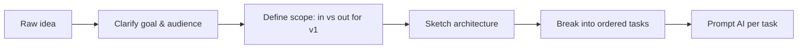

# Planning Before You Prompt

## Introduction

Planning is the step most vibe-coded projects skip — and the one whose
absence causes the most expensive failures. This page covers how to
plan effectively with AI as a collaborator: turning a vague idea into a
scoped spec, breaking it into ordered tasks, and deciding what *not* to
build yet.

## Why It Matters

AI models are extremely good at generating code for a well-specified
task and extremely bad at making the dozens of unstated product and
architecture decisions a vague request requires. Skipping planning
doesn't remove those decisions — it just means the model makes them for
you, silently, and you often disagree with the results once you see
them assembled into a full codebase.

## First Principles

1. **A plan is cheaper to change than code.** Catching a wrong
   assumption in a planning conversation costs minutes; catching it
   after 2,000 lines of generated code costs a rewrite.
2. **Scope is a decision, not a default.** Explicitly decide what's in
   v1 and what's deferred — don't let the model's assumptions decide it.
3. **Plans should be concrete enough to generate tasks from.** "Build a
   dashboard" is not a plan. "A dashboard with a revenue chart (last 30
   days), a user table (paginated, 20/page), and a CSV export button" is.
4. **Use AI in the planning step too** — it's good at surfacing
   questions and edge cases you haven't thought of, if you ask it to.

## How It Works

### From idea to build-ready plan



### Step 1 — Clarify the goal

Answer, in writing, before touching code:
- Who is this for, and what problem does it solve for them?
- What does success look like — what must be true when it's "done"?

### Step 2 — Scope ruthlessly

Write two lists: **In scope for v1** and **explicitly deferred**. Ask
your AI collaborator to help stress-test the split:

```text
Here's my feature idea: [description]. Help me split this into a
minimal v1 and a "later" list. Push back if you think something I put
in v1 isn't actually necessary for it to be useful.
```

### Step 3 — Sketch architecture before generating code

Even a rough sketch — which components exist, how they talk to each
other, what the data model looks like — prevents the AI from inventing
one you'll disagree with. See [System Design](../09-system-design/README.md).

### Step 4 — Break the plan into ordered, prompt-sized tasks

Each task should be small enough to review in one pass (see
[Introduction](../01-introduction/README.md)). A useful test: could you
describe this task's "done" condition in one sentence? If not, it's
still too big.

## Real Examples

**Before planning:** "Build me an app to track my expenses." → the
model invents a tech stack, a data model, an auth system, and a UI, none
of which you specified, all at once.

**After planning:**
```
v1 scope:
- Single user, no auth (local-only for now)
- Add expense: amount, category, date, note
- List view, filterable by category and date range
- SQLite storage

Deferred: multi-user, auth, charts, recurring expenses, mobile app.

Tasks:
1. Set up SQLite schema for expenses
2. Add-expense form + insert
3. List view with filters
4. (later) charts, auth, etc.
```
Each task is now independently promptable and reviewable.

## Best Practices

- Write the scope decision down, even for solo/small projects — it's
  easy to scope-creep back in mid-build without noticing.
- Ask the AI to challenge your scope, not just accept it.
- Sequence tasks so each one leaves the project in a working state.
- Revisit the plan after each task — treat it as a living document, not
  a one-time step.

## Common Mistakes

| Mistake | Why it hurts | Fix |
|---|---|---|
| Jumping straight to "build X" prompts | AI fills every gap with an unstated decision | Clarify goal and scope first |
| No explicit v1/later split | Scope creeps indefinitely, nothing ships | Write both lists before building |
| Planning once and never revisiting | Plans go stale as you learn from building | Revisit after each major task |
| Tasks too large to review in one pass | Defeats the point of AI-assisted iteration | Split until each task has a one-sentence "done" condition |

## Prompt Templates

```text
I want to build: [one-sentence idea].

Help me turn this into a build plan:
1. Ask me clarifying questions about goal, audience, and constraints.
2. Propose a minimal v1 scope and a "later" list — push back if
   something I want in v1 isn't essential.
3. Sketch a simple architecture (components + data model).
4. Break v1 into an ordered list of small, independently reviewable
   tasks.
```

## Summary

Planning turns a vague idea into a sequence of small, scoped,
independently reviewable tasks — the unit AI coding tools handle best.
Skipping this step doesn't save time; it just moves the cost from a
cheap planning conversation to an expensive rewrite later.

## Related Pages

- [Introduction to Vibe Coding](../01-introduction/README.md)
- [System Design](../09-system-design/README.md)
- [Prompt Engineering](../07-prompt-engineering/README.md)
- [Prompt Library: Planning](../../prompts/planning/)
