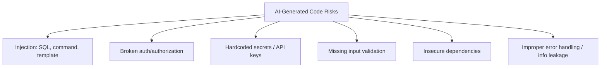

# Security in AI-Assisted Development

## Introduction

AI models can generate insecure code confidently and fluently — they
reproduce patterns from training data, including flawed ones, unless
explicitly guided otherwise. This page covers the security review
discipline every vibe-coded project needs, plus the vulnerability
classes AI-generated code most commonly introduces.

## Why It Matters

A security bug doesn't announce itself the way a functional bug does —
code can pass every test and demo perfectly while containing a SQL
injection, an auth bypass, or an exposed secret. Because AI-generated
code often "looks right" and works in the happy path, security review
has to be a deliberate step, not something you'll notice by accident.

## First Principles

1. **Never trust generated code with security-critical logic without
   review** — authentication, authorization, input validation, secrets
   handling, and cryptography deserve human eyes every time.
2. **AI models don't know your threat model.** They can't tell whether
   an internal admin tool and a public-facing API need different
   security postures unless you tell them.
3. **Ask for security explicitly.** Models frequently produce a
   functionally correct but insecure default (e.g., string-concatenated
   SQL) unless explicitly asked to avoid it.
4. **Defense in depth still applies.** Don't rely on the AI (or any
   single layer) to be your only safeguard — validate at multiple
   layers.

## How It Works

### Common vulnerability classes in AI-generated code



| Vulnerability class | Why AI tends to introduce it | Mitigation |
|---|---|---|
| SQL/command injection | String concatenation is a common "simple" pattern in training data | Always require parameterized queries / prepared statements explicitly |
| Broken authorization | Model doesn't know your permission model unless told | Specify roles/permissions explicitly; review every access-control branch |
| Hardcoded secrets | Models sometimes generate placeholder keys that get committed as-is | Never let generated code include real or plausible-looking secrets; use env vars |
| Missing input validation | "Happy path" code is what most training examples show | Explicitly request validation and error handling for all inputs |
| Outdated/insecure dependencies | Models may suggest deprecated or vulnerable packages from training data | Check package advisories before adding; use dependency scanning |
| Verbose error messages | Convenient for debugging, dangerous in production | Ask for generic external errors, detailed internal logs |

## Real Examples

**Insecure (unprompted default):**
```python
query = f"SELECT * FROM users WHERE email = '{email}'"
cursor.execute(query)
```

**Secure (explicitly requested):**
```python
query = "SELECT * FROM users WHERE email = %s"
cursor.execute(query, (email,))
```

The fix is one line — but only happens if you ask for it, or if you (or
a linter/reviewer) catch the unsafe pattern before merging.

## Best Practices

- Add "use parameterized queries, never string-concatenated SQL" (and
  equivalent rules for your stack) to your standing project instructions
  so every session inherits it.
- Run a dedicated security-focused prompt pass on any code that touches
  auth, payments, user data, or external input — don't rely on it being
  caught during a feature-focused review.
- Use static analysis / dependency scanning tools (e.g., `npm audit`,
  `pip-audit`, Semgrep, CodeQL) as a second, independent check —
  AI review and automated scanning catch different things.
- Never commit secrets output by a model, even placeholders that look
  real — rotate anything that touches a real credential.
- Treat AI-generated auth/authorization code as a first draft that
  needs a human security review before merge, always.

## Common Mistakes

| Mistake | Why it hurts | Fix |
|---|---|---|
| Assuming "it works" means "it's secure" | Functional and secure are different properties | Explicit security review pass |
| Not specifying auth/permission rules | AI can't infer your access model | State roles and permissions explicitly in the prompt |
| Committing AI-suggested example secrets | Even placeholders can be sensitive or get replaced with real ones and leaked | Use env vars/secrets managers, never inline |
| Skipping dependency review | AI can suggest outdated/vulnerable packages | Check advisories before adding any new dependency |
| No error-handling review | Verbose errors can leak internals | Explicitly request safe, generic external error messages |

## Prompt Templates

```text
Review this code for security issues, specifically:
- Injection (SQL, command, template, path traversal)
- Authentication/authorization correctness for [describe access model]
- Input validation gaps
- Sensitive data exposure (secrets, verbose errors, logs)

For each issue found: explain the risk, then propose a fix. Do not fix
silently without flagging what was wrong.
```

```text
Implement [feature] with these security requirements:
- All database queries must be parameterized.
- All user input must be validated server-side, not just client-side.
- Only [specific roles] may access this endpoint — enforce and test it.
- Do not include any secrets, keys, or credentials in the code; use
  environment variables and reference them by name only.
```

## Summary

AI-generated code needs explicit, deliberate security review — models
will confidently produce insecure defaults unless told otherwise, and
functional correctness is not evidence of security. Bake security
requirements into your prompts, run dedicated review passes on sensitive
code, and back AI review up with automated scanning tools.

## Related Pages

- [Authentication](../14-authentication/README.md)
- [Best Practices](../24-best-practices/README.md)
- [Common Mistakes](../25-common-mistakes/README.md)
- [Prompt Library: Security](../../prompts/security/)
