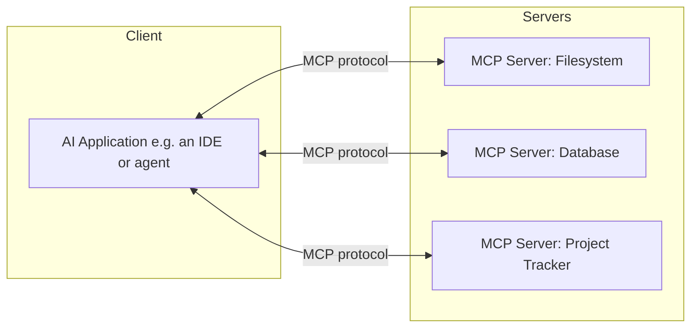

# MCP (Model Context Protocol)

## Introduction

The Model Context Protocol (MCP) is an open standard for connecting AI
models to external tools, data sources, and systems — file systems,
databases, APIs, project management tools — through a common interface,
instead of every AI application building bespoke, one-off integrations.

## Why It Matters

Before a standard like MCP, every AI tool needed a custom integration
for every data source it wanted to use — a combinatorial problem (M
tools × N data sources). MCP turns that into a linear problem: any
MCP-compatible tool can talk to any MCP-compatible data source through
the same protocol. For developers building AI-powered applications or
agents, this means integrations you build once can be reused across
different AI clients.

## First Principles

1. **MCP is a protocol, not a product.** It defines how a client (an AI
   application) and a server (a tool/data source) communicate — similar
   in spirit to how HTTP standardizes how browsers and web servers talk.
2. **Servers expose capabilities; clients consume them.** An MCP server
   might expose "tools" (actions the model can invoke), "resources"
   (data the model can read), or "prompts" (reusable templates).
3. **Least privilege matters.** An MCP server should expose only the
   capabilities it needs to — a read-only database server shouldn't also
   expose a delete-everything tool.
4. **Trust boundaries are real.** Anything an MCP server returns becomes
   part of the model's context — treat untrusted MCP data with the same
   caution as untrusted user input.

## How It Works



1. An MCP **client** (e.g., an AI-native IDE or agent) connects to one
   or more MCP **servers**.
2. Each server advertises the tools/resources/prompts it exposes.
3. During a conversation, the client can call a server's tool (e.g.,
   "run this SQL query," "create this ticket") on the model's behalf,
   subject to whatever permission model the client enforces.
4. Results flow back into the model's context, informing its next step.

## Real Examples

- A filesystem MCP server lets a coding agent read and edit project
  files directly, instead of you pasting file contents into a chat.
- A database MCP server lets a model query a read-only replica to answer
  "how many users signed up last week?" without you writing SQL by hand.
- A project-tracker MCP server lets a model create or update tickets
  based on a conversation, keeping project state in sync automatically.

## Best Practices

- Scope each MCP server to the minimum capability it needs — prefer
  read-only access unless write access is genuinely required.
- Review what data an MCP server exposes to the model before connecting
  it, especially for servers touching sensitive systems.
- Be cautious with MCP servers that fetch content from untrusted
  sources (e.g., arbitrary web pages) — treat their output as untrusted
  input, since a malicious page could attempt to inject instructions.
- Prefer well-maintained, actively developed MCP servers over
  abandoned ones — the ecosystem is young and quality varies.

## Common Mistakes

| Mistake | Why it hurts | Fix |
|---|---|---|
| Granting write access by default | Increases blast radius of a mistake or prompt injection | Start read-only, add write access deliberately |
| Connecting untrusted MCP servers | Server output becomes model context; a malicious server can manipulate behavior | Vet servers before connecting, prefer official/verified ones |
| Treating fetched MCP data as inherently trustworthy | External data can contain injected instructions | Apply the same skepticism as untrusted user input |
| No visibility into what a server can do | Hard to reason about what the model might act on | Review the server's advertised tools before use |

## Prompt Templates

```text
I'm building an MCP server that exposes [capability, e.g. "read-only
access to our orders table"]. Help me define:
1. The minimal set of tools/resources it should expose for this use case
2. What it should explicitly NOT expose
3. Input validation needed on any tool parameters
4. How to handle and report errors safely (no internal detail leakage)
```

## Summary

MCP standardizes how AI applications connect to external tools and data,
replacing bespoke integrations with a common protocol. It unlocks
powerful workflows — agents that can read your files, query your data,
and act on your tools directly — but each connected server expands your
trust surface, so scope permissions deliberately and treat external data
returned through MCP with the same caution as any other untrusted input.

## Related Pages

- [AI Agents](../22-ai-agents/README.md)
- [CLI Agents](../06-cli-agents/README.md)
- [Security](../18-security/README.md)
- [Prompt Library: MCP](../../prompts/mcp/)
