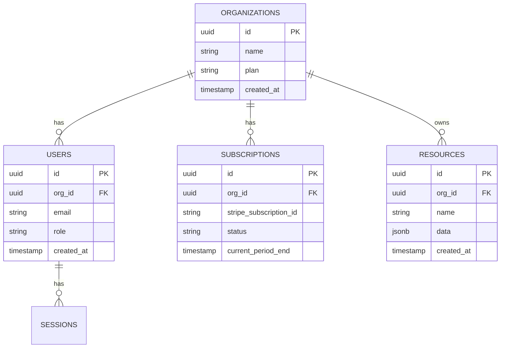
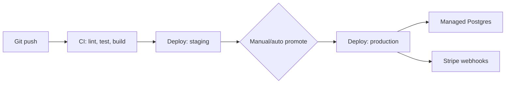

# Blueprint: SaaS Application

## Overview

A general-purpose blueprint for a multi-tenant SaaS product: user
accounts, subscription billing, a core app feature set, and an admin
surface. Use this as a planning reference — adapt scope to your actual
v1 per [Planning](../../../docs/08-planning/README.md).

## Tech Stack (reference choice, with rationale)

| Layer | Choice | Why |
|---|---|---|
| Frontend | React + TypeScript | Large ecosystem, strong AI tool support, good hiring pool |
| Backend | Node.js (Express or Fastify) or Python (FastAPI) | Both have mature AI-tool support and strong library ecosystems |
| Database | PostgreSQL | Relational integrity for billing/tenant data; JSONB for flexible fields when needed |
| Auth | Managed auth provider (e.g. Auth0, Clerk) for v1 | Avoid building auth from scratch initially — see [Security](../../../docs/18-security/README.md) |
| Billing | Stripe (Billing/Subscriptions) | Industry standard, well-documented, handles PCI compliance for you |
| Hosting | Managed platform (e.g. Render, Fly.io, Vercel+managed DB) for v1; move to raw cloud (AWS/GCP) only when scale demands it | Minimizes DevOps burden pre-product-market-fit |

This is a reference, not a mandate — the reasoning (managed services
first, minimize custom infra pre-PMF) matters more than the specific
vendor names.

## Folder Structure

```
saas-app/
├── apps/
│   ├── web/                 # frontend
│   └── api/                 # backend
├── packages/
│   ├── shared-types/        # shared TS types between web/api
│   └── ui/                  # shared component library (if needed)
├── infra/
│   ├── migrations/
│   └── deploy/
├── docs/
└── tests/
```

## Database Schema (core tables)



Notes:
- Multi-tenancy is modeled at the organization level; every core table
  carries an `org_id` foreign key, and every query must filter by it —
  this is the most security-critical convention in the whole schema. See
  [Security](../../../docs/18-security/README.md).
- Keep `RESOURCES` generic here; replace with your actual domain
  entities (e.g. `PROJECTS`, `INVOICES`) during planning.

## API Structure (reference)

| Endpoint group | Purpose |
|---|---|
| `/auth/*` | Handled by managed auth provider where possible |
| `/orgs/:id/*` | Org-scoped resources — every handler must verify the requesting user belongs to `:id` |
| `/billing/*` | Stripe webhook handling, subscription status |
| `/admin/*` | Internal-only, separate auth/permission check from customer-facing routes |

## Deployment



- Use a managed CI/CD pipeline (e.g. GitHub Actions) running lint, tests,
  and build on every PR — see [Testing](../../../docs/15-testing/README.md).
- Separate staging and production environments from day one; billing and
  auth bugs are expensive to debug directly in production.
- Handle Stripe webhooks idempotently — webhook delivery can retry, and
  duplicate processing must not double-charge or double-grant access.

## Scaling Considerations

| Concern | v1 approach | When to revisit |
|---|---|---|
| Database load | Single managed Postgres instance | Add read replicas when read load becomes the bottleneck, not preemptively |
| Background jobs | Simple queue (e.g. managed queue or cron) | Move to dedicated job infrastructure when volume/latency requirements grow |
| Multi-region | Single region | Only when you have customers requiring it — adds significant complexity |
| Caching | None, or simple in-memory | Add a cache layer (e.g. Redis) once specific slow queries are identified, not speculatively |

Avoid building for scale you don't have yet — see
[Common Mistakes](../../../docs/25-common-mistakes/README.md#7-letting-scope-creep-back-in-mid-build).

## Suggested Build Order

1. Org + user data model, managed auth integration
2. Core resource CRUD (your actual product feature, scoped to v1)
3. Stripe billing integration (subscribe, webhook handling, plan gating)
4. Admin surface (basic: view orgs, view subscription status)
5. Polish: error states, empty states, loading states
6. Deployment pipeline + staging environment

Each numbered item should be broken further into prompt-sized tasks per
[Planning](../../../docs/08-planning/README.md) before you start
generating code.

## Related

- [Planning](../../../docs/08-planning/README.md)
- [System Design](../../../docs/09-system-design/README.md)
- [Security](../../../docs/18-security/README.md)
- [Authentication](../../../docs/14-authentication/README.md)
